# Architecture

Visual architecture diagrams for the Forecasting Platform. Each section starts with a **big-picture overview** (grasp in 5 minutes) followed by a **deep dive** with class-level detail.

> All diagrams use [Mermaid](https://mermaid.js.org/) — GitHub renders them natively.

---

## 1. System Overview

How the major subsystems connect. Config drives everything; data flows left-to-right from ingestion through pipelines to consumers.

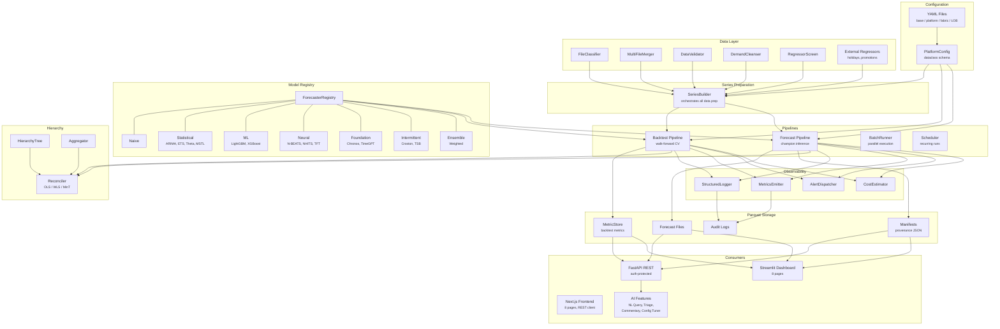

### Deep Dive: Configuration Hierarchy

Every pipeline parameter is defined via nested dataclasses in `src/config/schema.py`.

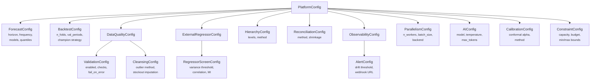

---

## 2. Data Flow

How raw data transforms into model-ready series, then splits into backtest and forecast paths.

```mermaid
graph LR
    RAW["Raw CSV / Parquet"]

    subgraph Preparation["SeriesBuilder.build()"]
        direction LR
        V["Validate<br/><small>schema, duplicates,<br/>frequency checks</small>"]
        SID["Build Series ID<br/><small>concat grain columns<br/>with | separator</small>"]
        TR["SKU Transitions<br/><small>stitch discontinued<br/>→ new SKUs</small>"]
        GF["Gap Fill<br/><small>complete date range,<br/>zero-fill missing</small>"]
        SBD["Structural Breaks<br/><small>detect & truncate<br/>to post-break</small>"]
        CL["Demand Cleansing<br/><small>outlier cap/replace,<br/>stockout imputation</small>"]
        DS["Drop Short Series<br/><small>min_series_length,<br/>zero-only filter</small>"]
        JEF["Join External<br/>Features<br/><small>promotions, holidays</small>"]
        SCR["Regressor Screen<br/><small>variance, correlation,<br/>MI filtering</small>"]

        V --> SID --> TR --> GF --> SBD --> CL --> DS --> JEF --> SCR
    end

    RAW --> V
    SCR --> MR["Model-Ready Series<br/><small>[series_id, week, quantity, ...features]</small>"]

    MR --> BT["Backtest Path"]
    MR --> FC3["Forecast Path"]

    subgraph BacktestPath["Backtest"]
        direction LR
        WF["Walk-Forward CV<br/><small>n_folds × n_models</small>"]
        MET2["Compute Metrics<br/><small>WMAPE, bias, MAE,<br/>MASE, RMSE</small>"]
        CS["Champion Selection<br/><small>rank by WMAPE,<br/>pick best model(s)</small>"]
        WF --> MET2 --> CS
    end

    subgraph ForecastPath["Forecast"]
        direction LR
        FIT["Fit Champion<br/><small>on full history</small>"]
        PRED["Predict Horizon<br/><small>point forecasts</small>"]
        QNT["Quantiles<br/><small>P10, P50, P90</small>"]
        CONF["Conformal<br/>Correction<br/><small>calibrate intervals</small>"]
        HREC["Reconcile<br/><small>hierarchy coherence</small>"]
        OUT["Output<br/><small>Parquet + Manifest</small>"]
        FIT --> PRED --> QNT --> CONF --> HREC --> OUT
    end

    BT --> WF
    FC3 --> FIT
    CS -.->|champion model| FIT
```

### Deep Dive: SeriesBuilder Internals

Each step is toggled by config flags. The `build()` method is the single entry point.

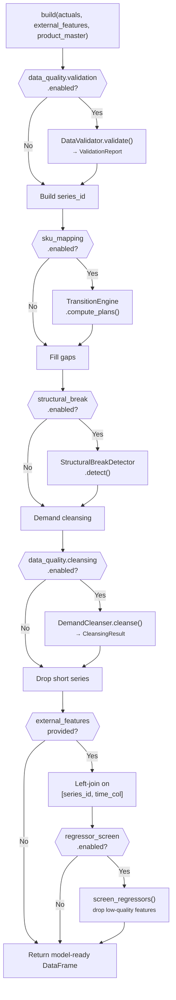

---

## 3. Backtest Pipeline

Walk-forward cross-validation evaluates every configured model across multiple time folds, then selects the champion.

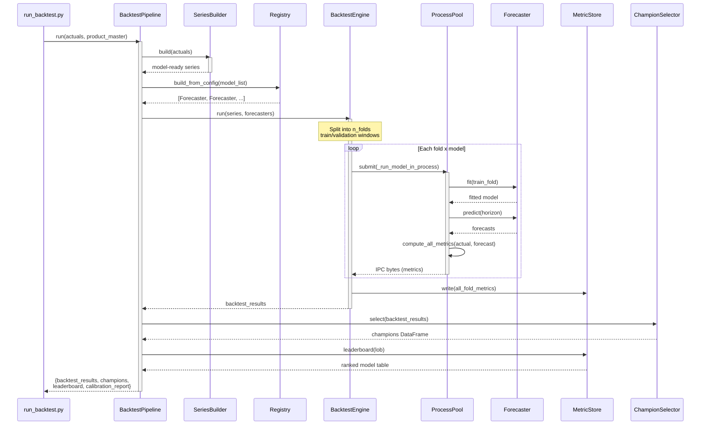

### Deep Dive: Walk-Forward Cross-Validation

The training window expands (or slides) and the validation window moves forward in time. Each fold evaluates all models on the same held-out period.

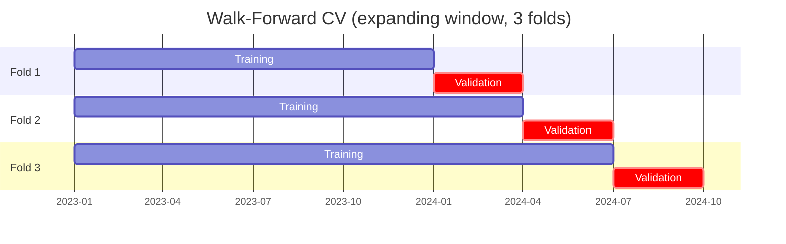

### Deep Dive: Model Registry

All forecasters inherit from `BaseForecaster` and register via the `@registry.register()` decorator.

```mermaid
classDiagram
    class BaseForecaster {
        <<abstract>>
        +name: str
        +fit(df, target_col, time_col, id_col)
        +predict(horizon, id_col, time_col) DataFrame
        +predict_quantiles(horizon, quantiles) DataFrame
        +validate_and_prepare(df) DataFrame
    }

    class SeasonalNaiveForecaster {
        name = "naive_seasonal"
    }

    class AutoARIMAForecaster {
        name = "auto_arima"
    }
    class AutoETSForecaster {
        name = "auto_ets"
    }
    class AutoThetaForecaster {
        name = "auto_theta"
    }
    class MSTLForecaster {
        name = "mstl"
    }

    class LGBMDirectForecaster {
        name = "lgbm_direct"
    }
    class XGBoostDirectForecaster {
        name = "xgboost_direct"
    }

    class NBEATSForecaster {
        name = "nbeats"
    }
    class NHITSForecaster {
        name = "nhits"
    }
    class TFTForecaster {
        name = "tft"
    }

    class ChronosForecaster {
        name = "chronos"
    }
    class TimeGPTForecaster {
        name = "timegpt"
    }

    class CrostonForecaster {
        name = "croston"
    }
    class CrostonSBAForecaster {
        name = "croston_sba"
    }
    class TSBForecaster {
        name = "tsb"
    }

    class WeightedEnsembleForecaster {
        name = "weighted_ensemble"
    }

    class HierarchicalForecaster {
        name = "hierarchical"
    }

    class ConstrainedDemandEstimator {
        name = "constrained"
    }

    BaseForecaster <|-- SeasonalNaiveForecaster
    BaseForecaster <|-- AutoARIMAForecaster
    BaseForecaster <|-- AutoETSForecaster
    BaseForecaster <|-- AutoThetaForecaster
    BaseForecaster <|-- MSTLForecaster
    BaseForecaster <|-- LGBMDirectForecaster
    BaseForecaster <|-- XGBoostDirectForecaster
    BaseForecaster <|-- NBEATSForecaster
    BaseForecaster <|-- NHITSForecaster
    BaseForecaster <|-- TFTForecaster
    BaseForecaster <|-- ChronosForecaster
    BaseForecaster <|-- TimeGPTForecaster
    BaseForecaster <|-- CrostonForecaster
    BaseForecaster <|-- CrostonSBAForecaster
    BaseForecaster <|-- TSBForecaster
    BaseForecaster <|-- WeightedEnsembleForecaster
    BaseForecaster <|-- HierarchicalForecaster
    BaseForecaster <|-- ConstrainedDemandEstimator
```

---

## 4. Forecast Pipeline

Production inference: fit the champion model on all available data and generate forecasts with prediction intervals.

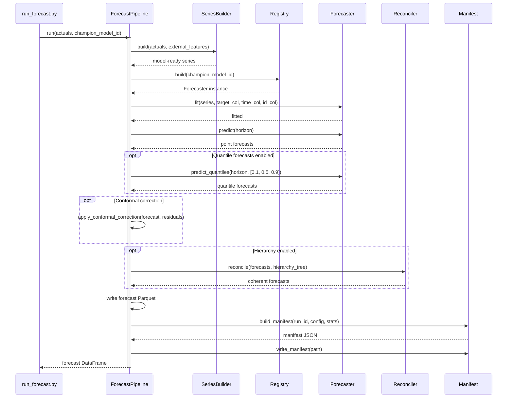

### Deep Dive: Hierarchical Reconciliation

Ensures forecasts are coherent — child node forecasts sum to parent nodes at every level of the hierarchy.

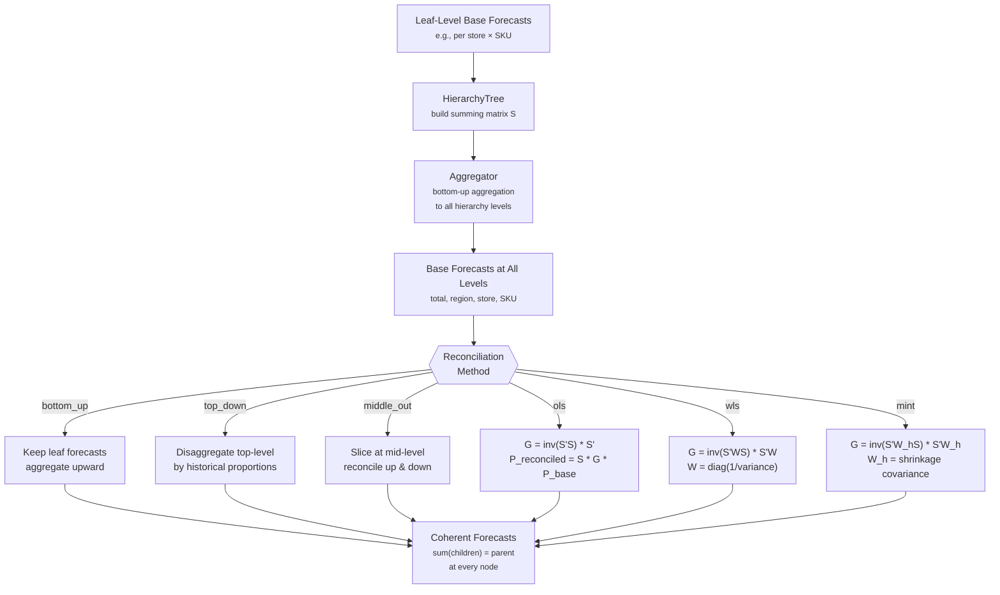

---

## 5. Data Onboarding

The Streamlit multi-file upload workflow: classify files, merge them, analyze the result, and generate a recommended config.

```mermaid
graph TD
    UP["User uploads<br/>1+ CSV/Parquet files"]

    UP --> CLASS["FileClassifier.classify_files()"]

    subgraph TwoPass["Two-Pass Classification"]
        direction TB
        P1["Pass 1: Isolation Scoring<br/><small>Score each file independently<br/>for time_series signals</small>"]
        P2["Pass 2: Cross-File Resolution<br/><small>Pick best primary, then re-evaluate<br/>remaining as dimension / regressor</small>"]
        P1 --> P2
    end

    CLASS --> TwoPass
    TwoPass --> ROLES["Classification Result<br/><small>primary: sales.csv<br/>dimension: stores.csv<br/>regressor: promotions.csv</small>"]

    ROLES --> CONFIRM1{"User confirms<br/>or overrides roles"}

    CONFIRM1 --> MERGE["MultiFileMerger"]

    subgraph MergeSteps["Merge Process"]
        direction TB
        DJK["Detect Join Keys<br/><small>dimension: shared ID cols<br/>regressor: time_col ± id_col</small>"]
        PREV["Generate Preview<br/><small>sample rows, match rate,<br/>null fills, conflicts</small>"]
        EXEC["Execute Left-Joins<br/><small>dimension on IDs<br/>regressor on time ± IDs<br/>fill nulls with 0</small>"]
        DJK --> PREV --> EXEC
    end

    MERGE --> MergeSteps

    EXEC --> CONFIRM2{"User confirms<br/>merge preview"}

    CONFIRM2 --> ANALYZE["DataAnalyzer.analyze()"]

    subgraph Analysis["Analysis"]
        direction TB
        SCHEMA["Schema Detection<br/><small>time col, target col,<br/>ID cols, grain</small>"]
        FORE["Forecastability<br/><small>CV, entropy,<br/>intermittent ratio</small>"]
        HIER["Hierarchy Inference<br/><small>cardinality-based<br/>level detection</small>"]
        SCHEMA --> FORE --> HIER
    end

    ANALYZE --> Analysis
    Analysis --> CFG["Recommended PlatformConfig<br/><small>YAML with models, horizon,<br/>frequency, hierarchy</small>"]
    CFG --> ACCEPT{"User accepts config"}
    ACCEPT --> READY["Ready for Pipeline<br/><small>run_backtest.py or<br/>run_forecast.py</small>"]
```

### Deep Dive: Classification Heuristics

The isolation scoring pass uses weighted signals to determine if a file is a time series.

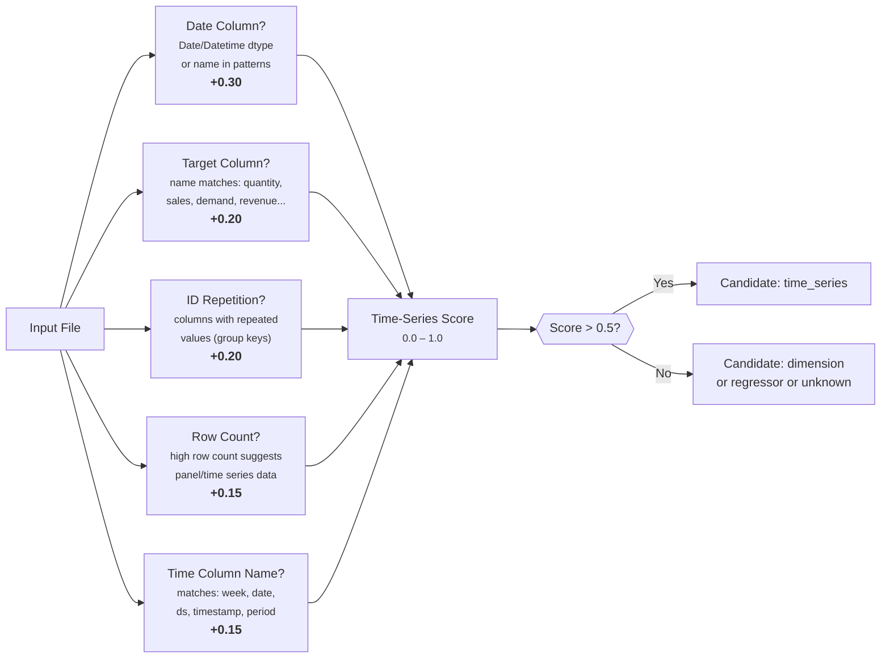

---

## 6. API & Dashboard

How external consumers — REST clients, dashboard users, and AI features — access the platform.

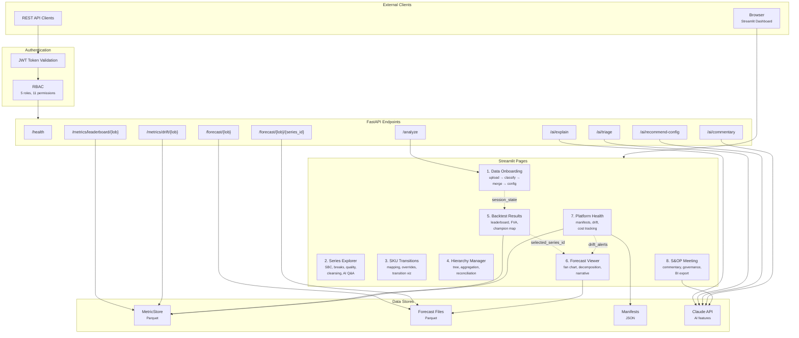

### Deep Dive: API Endpoint Map

| Method | Path | Auth | Data Source | Description |
|--------|------|------|-------------|-------------|
| `GET` | `/health` | None | — | Liveness probe |
| `GET` | `/forecast/{lob}` | `read:forecast` | Forecast Parquet | Latest forecast for LOB |
| `GET` | `/forecast/{lob}/{series_id}` | `read:forecast` | Forecast Parquet | Single series forecast |
| `GET` | `/metrics/leaderboard/{lob}` | `read:metrics` | MetricStore | Model leaderboard |
| `GET` | `/metrics/drift/{lob}` | `read:metrics` | MetricStore | Drift alerts |
| `POST` | `/analyze` | `write:config` | Upload CSV | Auto-detect schema, recommend config |
| `POST` | `/ai/explain` | `read:ai` | Claude API | NL query about forecasts |
| `POST` | `/ai/triage` | `read:ai` | Claude API | Triage drift alerts by impact |
| `POST` | `/ai/recommend-config` | `write:config` | Claude API | Config tuning recommendations |
| `POST` | `/ai/commentary` | `read:ai` | Claude API | Executive forecast commentary |

### Deep Dive: Streamlit Session State Flow

Cross-page navigation uses `st.session_state` to pass context between pages.

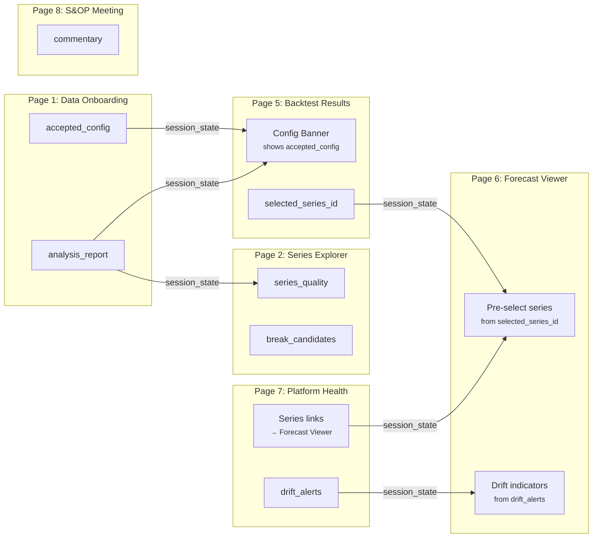

### Deep Dive: Next.js Frontend

The Next.js frontend is an alternative UI that communicates with the same FastAPI backend over REST. It mirrors the 8-page workflow but runs as a standalone Node.js application.

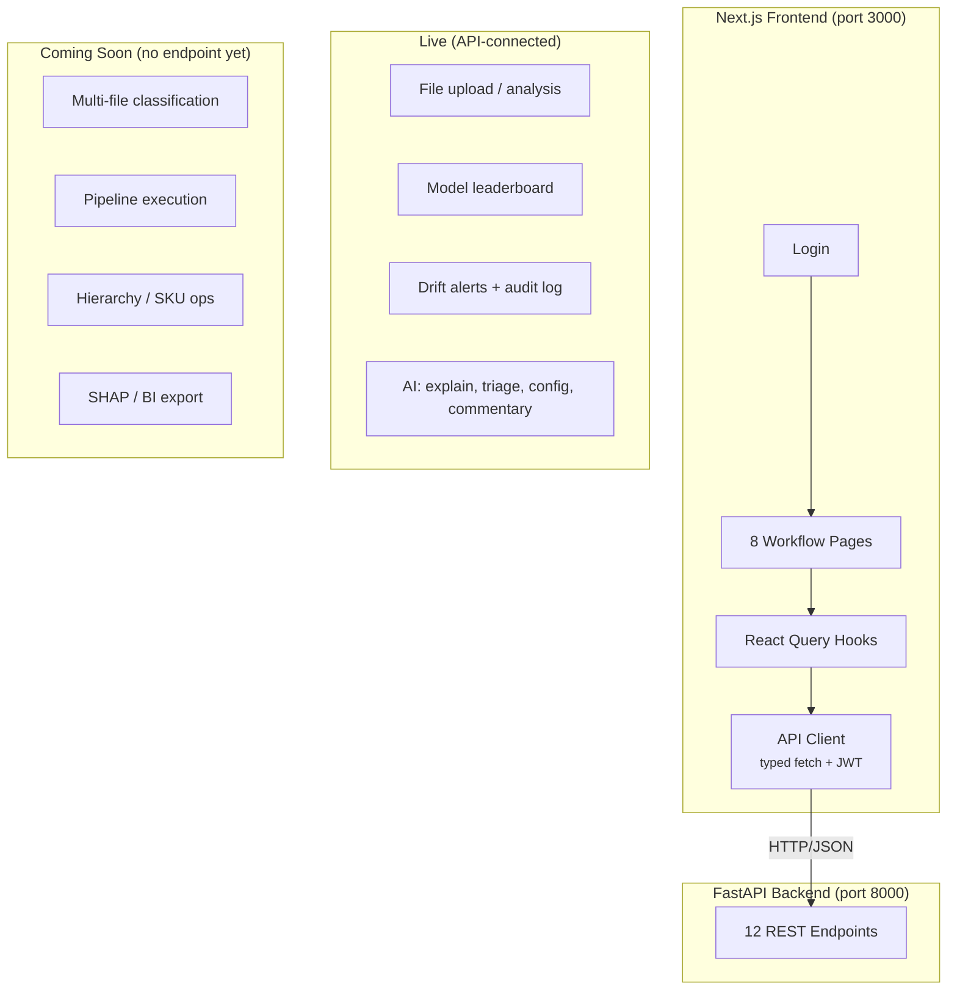

---

## 7. Observability & Audit

Cross-cutting concerns that run alongside every pipeline execution.

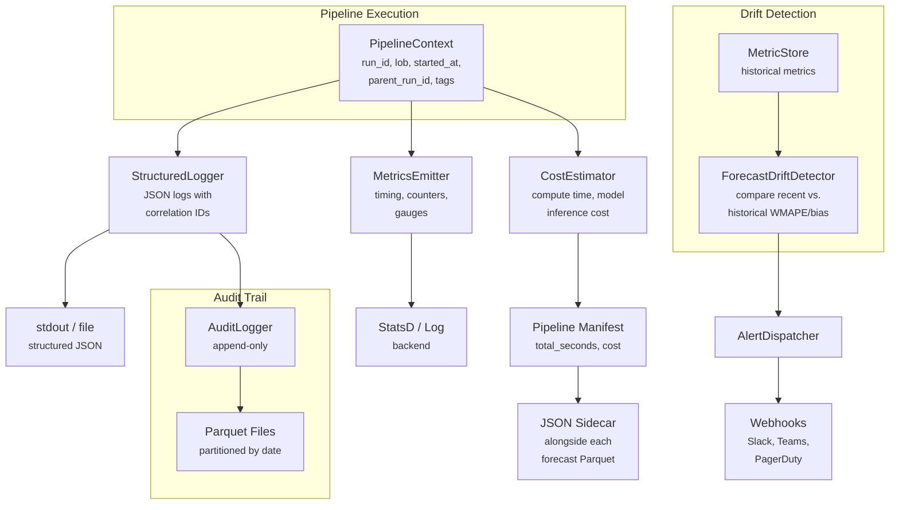

---

## 8. Data Schemas

The four core data structures that flow through the platform.

### Series DataFrame (input to models)

| Column | Type | Description |
|--------|------|-------------|
| `series_id` | `Utf8` | Composite key, e.g. `"US\|East\|SKU123"` |
| `week` | `Date` | Period start date (Monday for weekly) |
| `quantity` | `Float64` | Demand / sales value |
| `<feature_1>` | `Float64` | External regressor (optional) |
| `<feature_N>` | `Float64` | Additional features (optional) |

### Forecast Output

| Column | Type | Description |
|--------|------|-------------|
| `series_id` | `Utf8` | Matches input series |
| `week` | `Date` | Future period date |
| `forecast` | `Float64` | Point forecast |
| `forecast_p10` | `Float64` | 10th percentile (optional) |
| `forecast_p50` | `Float64` | Median forecast (optional) |
| `forecast_p90` | `Float64` | 90th percentile (optional) |

### Metric Store Record

| Column | Type | Description |
|--------|------|-------------|
| `run_id` | `Utf8` | Unique run identifier |
| `run_type` | `Utf8` | `"backtest"` or `"live"` |
| `run_date` | `Date` | Execution date |
| `lob` | `Utf8` | Line of business |
| `model_id` | `Utf8` | Model name from registry |
| `fold` | `Int32` | CV fold index |
| `series_id` | `Utf8` | Series identifier |
| `target_week` | `Date` | Forecast target date |
| `forecast_step` | `Int32` | Steps ahead (1..horizon) |
| `actual` | `Float64` | Ground truth value |
| `forecast` | `Float64` | Predicted value |
| `wmape` | `Float64` | Weighted MAPE |
| `normalized_bias` | `Float64` | Bias / mean(actuals) |
| `mae` | `Float64` | Mean Absolute Error |
| `rmse` | `Float64` | Root Mean Squared Error |
| `mase` | `Float64` | Mean Absolute Scaled Error |

### Pipeline Manifest (JSON)

```json
{
  "run_id": "abc123def456",
  "timestamp": "2024-06-01T14:30:00",
  "lob": "retail",
  "input_data_hash": "sha256:...",
  "input_row_count": 52000,
  "input_series_count": 1000,
  "date_range_start": "2022-01-01",
  "date_range_end": "2024-05-31",
  "cleansing_applied": true,
  "outliers_clipped": 145,
  "stockout_periods_imputed": 23,
  "validation_passed": true,
  "regressors_dropped": ["low_variance_feature"],
  "config_hash": "sha256:...",
  "champion_model_id": "lgbm_direct",
  "backtest_wmape": 0.0842,
  "forecast_horizon": 39,
  "forecast_row_count": 39000,
  "forecast_file": "forecast_retail_2024-06-01.parquet"
}
```
